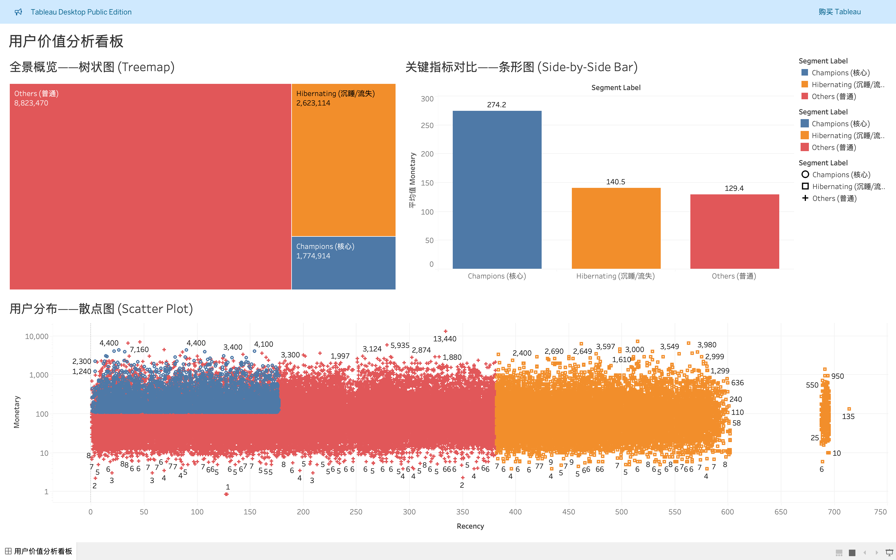

# 🛒 Olist E-commerce Customer Segmentation & RFM Analysis
> **利用 RFM 模型与 K-Means 聚类对巴西电商用户进行价值分层与流失预警**

[](https://www.python.org/)
[](https://pandas.pydata.org/)
[](https://public.tableau.com/)

## 📖 1. 项目背景 (Business Problem)
**数据源：** [Brazilian E-Commerce Public Dataset by Olist](https://www.kaggle.com/olistbr/brazilian-ecommerce) (100k+ 订单数据)

作为一家电商平台，Olist 面临着用户留存率低、营销资源分配不均的问题。为了提高营销 ROI（投资回报率），本项目旨在解决以下商业问题：
1.  如何识别高价值客户（High-Value Customers）？
2.  如何区分即将流失的用户并进行预警？
3.  如何基于用户行为制定差异化的营销策略？

## 🛠️ 2. 技术栈与方法论 (Tech Stack & Methodology)
本项目采用 **RFM 模型 (Recency, Frequency, Monetary)** 作为核心分析框架。

* **数据清洗 (Python/Pandas):**
    * 处理多表连接 (9张关系表)，解决 `customer_id` 与 `unique_id` 的混淆问题。
    * 处理时间戳格式与缺失值，过滤非交付订单。
* **特征工程 (Feature Engineering):**
    * 计算 R, F, M 核心指标。
    * **难点解决：** 针对数据严重的长尾分布（Skewed Data），使用 `Rank` + `Quantile` (分位数法) 进行 1-5 分的动态打分。
* **可视化 (Tableau):**
    * 构建交互式仪表盘，展示用户分层画像与价值分布。

## 📊 3. 核心发现 (Key Insights)
经过对 96,000+ 名用户的分析，我们得出了以下关键结论：

1.  **二八定律验证：** 仅 **1%** 的顶级用户 (RFM=555) 贡献了极其可观的营收比例。这些 "Champions" 是平台的核心资产。
2.  **流失预警：** "Hibernating" (沉睡) 用户群体的平均未购买天数已超过 **400天**。针对此群体的通用营销邮件 ROI 极低，建议停止高成本投放。
3.  **用户习惯：** 绝大多数用户 (90%+) 仅购买过一次。平台当务之急不是“推销昂贵新品”，而是设计“首单后的复购激励机制” (如次单 8 折券)。

## 📈 4. 可视化仪表盘 (Dashboard)
点击链接查看可交互的 Tableau 仪表盘：

👉 **[https://public.tableau.com/app/profile/ethan.chen6113/viz/OlistE-commerceRFMAnalysis/sheet0?publish=yes]**



## 📊 Olist 电商用户价值分析看板 (RFM Model)
基于巴西 Olist 电商公开数据集，利用 RFM (Recency, Frequency, Monetary) 模型进行用户分层。

### 🔍 核心洞察：
1.  **价值分布**：通过树状图与条形图分析发现，**Champions（核心用户）** 虽仅占少数，但贡献了极高的平均消费额，是平台利润的主要来源。
2.  **流失预警**：通过散点图定位了大量 **Hibernating（沉睡/流失）用户**，他们通常表现为“距上次购买时间较长”且“消费频次较低”。
3.  **运营策略**：针对不同分层制定差异化策略（如对核心用户做 VIP 权益捆绑，对沉睡用户发放定向优惠券唤回）。

## 💻 5. 代码结构 (Project Structure)
核心分析逻辑位于 `notebooks/` 文件夹中：
1.  **Data Loading:** 读取 Orders, Items, Customers 表。
2.  **Data Cleaning:** 时间标准化，去重。
3.  **RFM Calculation:**
    ```python
    # 核心代码片段：解决长尾分布的 Rank 算法
    rfm['F_Score'] = pd.qcut(rfm['Frequency'].rank(method='first'), q=5, labels=[1,2,3,4,5])
    ```
4.  **Segmentation:** 将用户标记为 Champions, Loyal, Hibernating 等。

## 🚀 6. 如何运行 (How to Run)
1.  Clone this repository.
2.  Install requirements: `pip install pandas numpy`
3.  Run the Jupyter Notebook in the `notebooks` folder.

---
*Author: [Ethan Chen]*

*Contact: [17701858351@163.com]*
